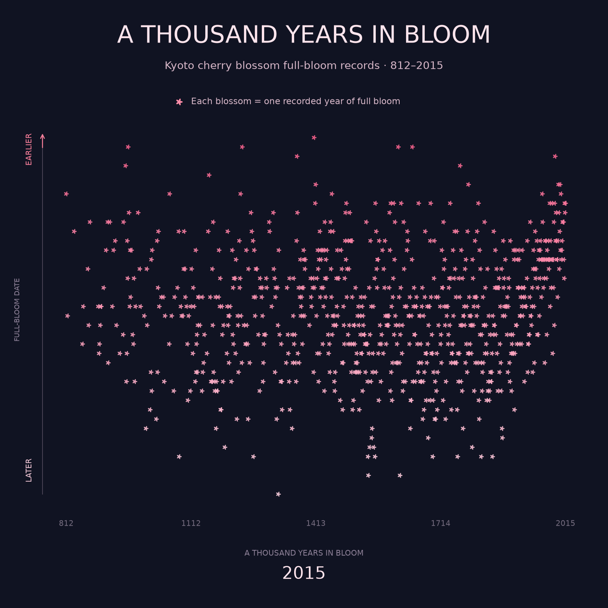
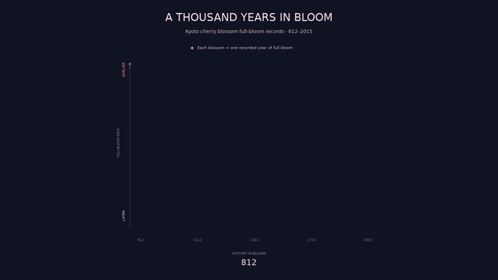

# A Thousand Years in Bloom



## The phenomenon

*A Thousand Years in Bloom* visualises the historical changes in cherry blossom full-bloom dates in Kyoto from 812 to 2015. I chose this phenomenon because cherry blossoms are strongly associated with the arrival of spring, but their flowering dates are not fixed. Looking across more than a thousand years makes it possible to see how the timing of full bloom has varied throughout history.

Instead of using ordinary dots, I used small five-petal blossoms so that the visual language is directly connected to the subject of the data.

## The source

The data comes from the `SakuraData4.csv` dataset:

https://gist.githubusercontent.com/thulse/597ef42bbca981508545c053a0ba7775/raw/7558f6576b8d520abb85b449542e59da8372edb9/SakuraData4.csv

The dataset contains historical Kyoto cherry blossom records. Each usable record includes a year and a `flowering_day`, representing the day of the year when full bloom was recorded. After removing rows without usable flowering dates, 827 valid flowering records are used in my visualisation, covering the years 812–2015 and flowering days 86–124.

## What the picture shows

Each blossom represents one recorded year of full bloom. The horizontal position represents historical year, moving from 812 on the left to 2015 on the right. The vertical position represents the full-bloom date: earlier flowering dates appear higher and later dates appear lower. Blossom colour also changes with flowering date, reinforcing this difference.

The visualisation focuses on year and full-bloom timing. It does not show other information from the original dataset, such as source type or estimated temperature. Missing flowering records are also not represented as blossoms.

I also created an animated version. The blossoms gradually appear as the timeline moves from 812 to 2015. After the complete historical record is shown, the blossoms fall away and the timeline begins again. The falling motion is a visual transition rather than another data variable.

## Animation



## Run it

```bash
uv run fetch.py
uv run plot.py
uv run animate.py